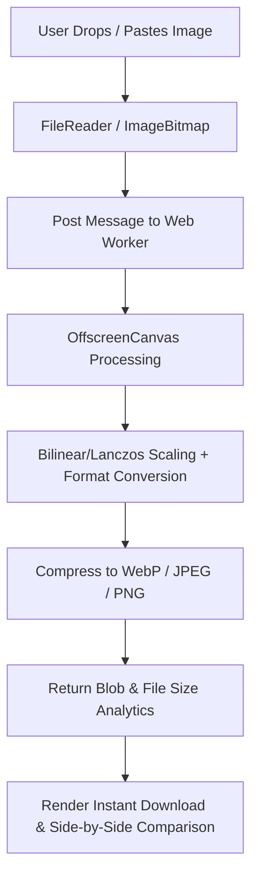

# 🚀 Muhajim (مُحجِّم) — In-Browser Smart Image Resizer & Optimizer
## Master Project Plan & Software Requirements Specification (SRS)
**Parent Organization:** Novixa Digital Engineering  
**Version:** 1.0.0  
**Target Architecture:** 100% Client-Side (Web Workers + OffscreenCanvas + WebAssembly)  
**Primary Language & Direction:** Arabic (`ar`) — RTL First  
**Global Reach:** Top 20 Spoken Languages with Dynamic SEO & Hreflang  

---

## 1. Executive Summary & Value Proposition

### 1.1 Core Mission
**Muhajim (مُحجِّم)** is an ultra-fast, zero-friction single-purpose utility web application built by Novixa. It allows users to resize, compress, crop, and convert images instantly inside their browser without uploading files to any external server. 

### 1.2 Competitive Analysis & Differentiation

| Feature / Metric | Existing Tools (SimpleImageResizer, PicResize, etc.) | **Muhajim (مُحجِّم)** |
| :--- | :--- | :--- |
| **Data Processing** | Server Upload (Slow, Security Risk) | **100% In-Browser (Web Worker + Canvas)** |
| **Privacy & Security** | Files transmitted to 3rd party servers | **Zero transmission; files never leave device** |
| **Server Compute Cost** | High Cloud Server Costs | **$0 Infrastructure Cost** |
| **Language & RTL Support**| English-only or basic auto-translate | **Arabic-First (Native RTL) + 20 Global Languages** |
| **User Experience (UX)** | Cluttered, heavy popups, slow loading | **Glassmorphic UI, Sub-100ms processing, 60fps** |
| **Preset Dimension Engine**| Manual pixel entry only | **One-click presets (Social, E-Commerce, Govt ID)** |

---

## 2. Monetization & Business Model

Muhajim maximizes revenue generation while preserving Core Web Vitals and user trust:

1. **Non-Intrusive Display & Native Ads:**
   - Single sticky bottom banner unit.
   - Side rail banner on desktop (>1280px).
   - Strict ban on interstitial modal popups (vignettes) to ensure 100/100 Lighthouse performance.
2. **Contextual Affiliate Marketing:**
   - "Need complete graphic design? Try Canva Pro" affiliate badge under the download action.
   - E-commerce tools recommendation (Shopify / Salla / Zid) for product image optimization users.
3. **Novixa Ecosystem Conversion Funnel:**
   - Dedicated "Powered by Novixa" badge routing enterprise clients to Novixa's custom software development team.
4. **Support & Micro-Donations:**
   - "Buy Me a Coffee" CTA for supporters.
5. **Future B2B Developer API:**
   - Cloudflare Workers edge API for automated bulk image transformation ($9–$49/mo).

---

## 3. Supported Languages & i18n Strategy

The platform operates as **Arabic Default (`/`)** with seamless switching for the top 20 global languages:

| # | Language Name | ISO Code | Text Direction | Route Prefix |
|---|---|---|---|---|
| 1 | العربية (Default) | `ar` | **RTL** | `/` or `/ar` |
| 2 | English | `en` | LTR | `/en` |
| 3 | Español (Spanish) | `es` | LTR | `/es` |
| 4 | 简体中文 (Chinese) | `zh` | LTR | `/zh` |
| 5 | हिन्दी (Hindi) | `hi` | LTR | `/hi` |
| 6 | Français (French) | `fr` | LTR | `/fr` |
| 7 | Português (Portuguese) | `pt` | LTR | `/pt` |
| 8 | Русский (Russian) | `ru` | LTR | `/ru` |
| 9 | Bahasa Indonesia | `id` | LTR | `/id` |
| 10 | Deutsch (German) | `de` | LTR | `/de` |
| 11 | 日本語 (Japanese) | `ja` | LTR | `/ja` |
| 12 | Türkçe (Turkish) | `tr` | LTR | `/tr` |
| 13 | 한국어 (Korean) | `ko` | LTR | `/ko` |
| 14 | Italiano (Italian) | `it` | LTR | `/it` |
| 15 | اردو (Urdu) | `ur` | **RTL** | `/ur` |
| 16 | فارسی (Persian) | `fa` | **RTL** | `/fa` |
| 17 | Tiếng Việt (Vietnamese) | `vi` | LTR | `/vi` |
| 18 | Polski (Polish) | `pl` | LTR | `/pl` |
| 19 | Nederlands (Dutch) | `nl` | LTR | `/nl` |
| 20 | বাংলা (Bengali) | `bn` | LTR | `/bn` |

---

## 4. Technical Architecture & Tech Stack

### 4.1 Core Stack
- **Framework:** React 18 + TypeScript + Vite (Lightning-fast Static Site Generation / Single Page Application).
- **Styling:** Tailwind CSS v4 (Logical properties `ms-`, `me-`, `text-start`, `rtl:` for instant LTR/RTL support).
- **Icons:** Lucide React.
- **Image Engine:** Dedicated Web Worker (`src/workers/image.worker.ts`) using HTML5 `Canvas` / `OffscreenCanvas` & Lancaster-3 / Bilinear interpolation for crisp scaling without main thread lockup.
- **State Management:** Zustand / Lightweight React State with Blob URL memory cleanup (`URL.revokeObjectURL`).
- **Hosting & CDN:** Cloudflare Pages / Vercel Edge ($0 server compute cost).

### 4.2 System Data Flow

---

## 5. UI/UX Component Specifications

1. **Header Component (`Header.tsx`):**
   - Novixa Brand Badge + Muhajim Logo.
   - Language Selector Dropdown (Flags, Search, Localized names).
   - Theme Toggle (Dark / Light Mode).
   - Privacy Guarantee Badge ("100% In-Browser & Secure").
2. **Dropzone Area (`Dropzone.tsx`):**
   - Drag-and-drop zone with animated subtle glowing border.
   - Direct Clipboard Paste listener (`Ctrl + V`).
   - Image thumbnail preview with initial dimensions (WxH) and file size (KB/MB).
3. **Controls Panel (`ControlsPanel.tsx`):**
   - **Percentage Slider:** 10% to 200% scaling.
   - **Custom Pixel Inputs:** Width x Height with aspect ratio lock toggle.
   - **Social & Utility Presets (`Presets.tsx`):**
     - Instagram (Post 1:1, Story 9:16, Landscape 1.91:1)
     - YouTube (Thumbnail 1280x720, Banner 2560x1440)
     - X / Twitter (Header 1500x500, Post 16:9)
     - E-Commerce (Square 1000x1000, WebP optimization)
     - Official ID / Documents (Passport size, Under 100KB limit preset)
   - **Format & Quality Selector:** WebP (recommended), JPEG, PNG, AVIF with live compression slider.
4. **Comparison & Download Bar (`DownloadBar.tsx`):**
   - Live file size comparison (e.g., "4.2 MB ➔ 320 KB — Reduced by 92%").
   - Download Button + Batch Export Zip (if multi-file selected).
5. **SEO & Educational Content Section (`SeoSection.tsx`):**
   - Deep localized explanatory content for search engines explaining image compression algorithms, privacy benefits, and format guides.
6. **Footer (`Footer.tsx`):**
   - Novixa copyright, Privacy Policy, Terms, and 20-language sitemap directory.

---

## 6. Project Roadmap & Milestones

- [x] Phase 1: Architecture Blueprint & Requirements Specification (`PROJECT_PLAN.md` & `Muhajim_PRD.md`)
- [x] Phase 2: Project Scaffolding (Vite + React 18 + TS + Tailwind v4 + Lucide)
- [x] Phase 3: Core Image Processing Web Worker (`image.worker.ts` with OffscreenCanvas + EXIF orientation + Cover/Contain/Stretch)
- [x] Phase 4: i18n Localization Engine (20 Languages + RTL/LTR auto-switching + Dynamic Query URL sync)
- [x] Phase 5: High-Aesthetic Glassmorphic UI & Preset Engine (Social, E-Commerce, Govt ID presets)
- [x] Phase 6: Programmatic SEO, JSON-LD Schemas, Sitemap, Robots.txt & Production Deployment Setup (Vercel / Cloudflare)

